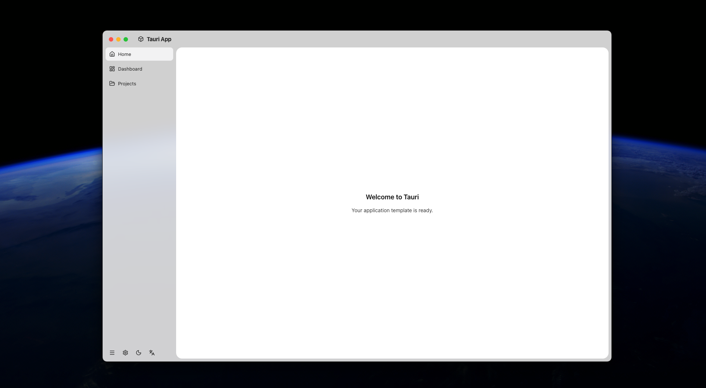
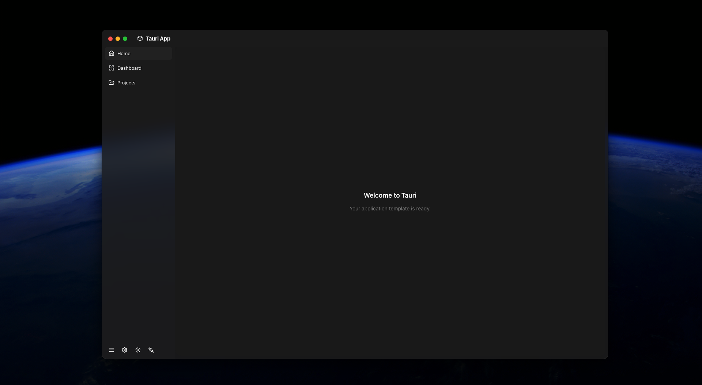

# Tauri Template App

Tauri 2 + React 19 + TypeScript desktop application template.

## Screenshots

| Light Mode | Dark Mode |
|------------|-----------|
|  |  |

## Stack

| Layer | Technology |
|-------|-----------|
| **Backend** | Tauri 2 (Rust), SQLite (rusqlite), tracing |
| **Frontend** | React 19, TypeScript, TailwindCSS v4 |
| **State** | Zustand (theme), react-i18next (i18n) |
| **Icons** | Lucide React |

## Prerequisites

- **Rust** — `rustup` toolchain (stable)
- **Node.js** — 20+ (LTS)
- **macOS**: Xcode command line tools (`xcode-select --install`)
- **Windows**: [Microsoft Visual Studio C++ Build Tools](https://visualstudio.microsoft.com/visual-cpp-build-tools/) (with "Desktop development with C++" workload) + WebView2 Runtime (preinstalled on Win10 1803+)
- **Linux**: `webkit2gtk-4.1`, `libssl-dev`, `libgtk-3-dev`, `librsvg2-dev`, `libayatana-appindicator3-dev`

## Quick Start

```bash
# Install dependencies
npm install

# Run in dev mode (opens Tauri window)
npm run tauri dev

# Build for production
npm run tauri build
```

## Project Structure

```
├── src/                 # React frontend
│   ├── App.tsx          # Main layout: sidebar + content area
│   ├── stores/          # Zustand stores (theme, language)
│   ├── i18n/            # zh/en translations
│   └── types/           # Shared TypeScript types
├── src-tauri/           # Rust backend
│   ├── src/
│   │   ├── lib.rs       # Tauri Builder, window setup, macOS vibrancy
│   │   ├── main.rs      # Entry point
│   │   ├── commands/    # IPC handlers (window, log, settings)
│   │   ├── db.rs        # SQLite helpers with WAL mode
│   │   └── settings.rs  # Key-value config store
│   └── tauri.conf.json  # App config (name, window, bundle)
└── package.json
```

## Built-in Features

- **Cross-platform window management**
  - macOS: vibrancy (NSVisualEffectView), traffic-light overlay, window shadow, focus fix
  - Windows: native min/max/close buttons in the top bar, dragging
  - Linux: overlay-aware top bar layout
- **Window state persistence** — position, size, maximized flag saved to disk and restored on launch (debounced 3s polling + on-resize/move events + on-close)
- **Draggable top bar** — entire header acts as drag region; double-click to maximize on Windows
- **Theme switching** — light/dark mode, persisted to localStorage
- **i18n** — English / Chinese language toggle
- **SQLite config** — key-value settings store (`sys_config` table)
- **Logging** — tracing-subscriber → SQLite log entries (queryable from frontend)

## Customization

Find and replace these identifiers when adapting the template:

| Placeholder | What it affects | Files to change |
|-------------|----------------|-----------------|
| `tauri-template-app` | npm package name, Rust crate name, localStorage keys | `package.json`, `src-tauri/Cargo.toml`, `src/stores/themeStore.ts`, `src/i18n/index.ts`, `src/main.tsx` |
| `"Tauri App"` / `"tauri_template_app"` | window title, macOS app name | `tauri.conf.json`, `index.html`, `src-tauri/src/main.rs` |
| `com.example.tauri-app` | macOS bundle ID / Windows publisher | `tauri.conf.json` |
